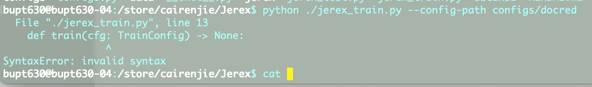
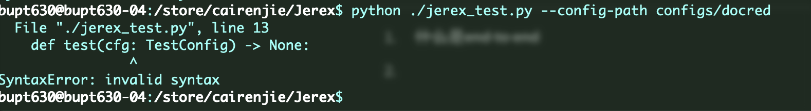
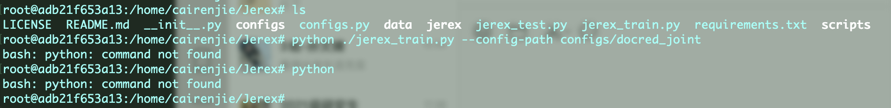
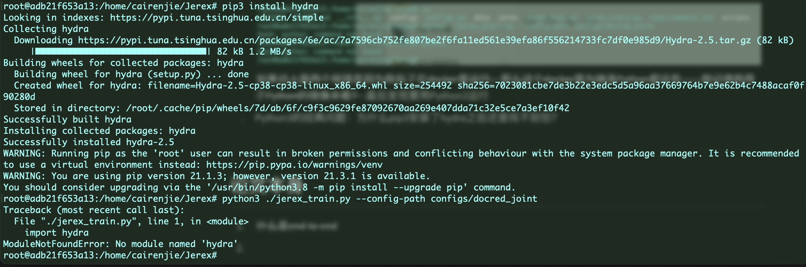
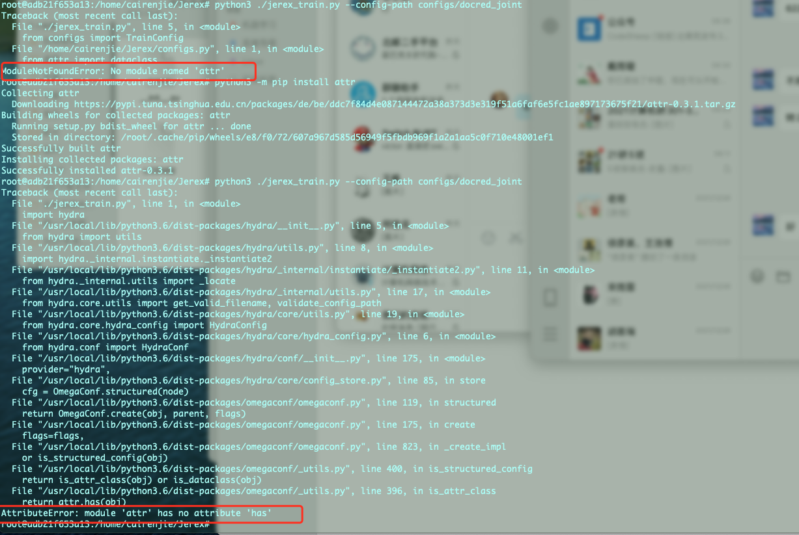

# 问题列表

## 容器操作方面

1. ~~容器创建的镜像选择~~：采用 Ubuntu18.04 + python3.8 + cudann8 + cuda11.1
1. 直接从dockerhub找现成的镜像，无果，找到一个合适的结果总是显示pull失败，属实离谱
2. 容器内部环境搭建:
   1. git无法执行，publickey出错
   2. scp上传本地文件存在权限问题，无法直接上传至store文件夹，只能通过home中转
   3. pytorch，cuda，cudnn这些东西怎么查看安装的情况
   4. 


## 准备阶段

1. 看不懂给出的文件系统结构，不知道训练材料DocRED的数据集应该怎么放


## 运行阶段

1. 

   莫名其妙的代码本身报错

2. 

   怎么都报错？？？？

3. 

   ~~如果说上面两个报错是因为我忘了在docker里运行，那么这个docker里为啥连Python都没有……我记得我用了Python的镜像来着？~~:最后发现要用Python3运行

4. ~~Python3的经典问题：为什么pip3安装了hydra之后还是找不到包？~~:改用以下格式指令安装包：

   ```shell
   python3 -m pip install numpy
   ```

   

   

5. 

   为什么有文档里未提及的包`attr`要安装？？？为什么安装了之后缺少调用的模块？？？？
   
   > 尝试1：使用`python`而不是`python3`：失败，Python安装后没有pip
   >
   > 尝试2：安装pip
   >
   > 1. 使用`python -m ensurepip`，失败，显示应该用`apt-get install python-pip`
   > 2. 使用第一条里推荐的指令，失败，显示需要升级一大堆依赖包，怒而放弃
   >
   > 尝试3：使用`sudo apt-get install python-is-python3`，结果发现居然sudo都无法执行？？？
   >
   > 删除sudo再次执行，找不到这个包，怒而放弃

			1. 后来发现docker里不知道为啥多出来一个Python3.6，和3.8居然是共存的……每次运行Python3总是默认采用3.6的版本，所有的依赖包也都是安装在3.6的下面
			1. 重新给3.8安装依赖：

## 论文本身

1. ~~什么是end to end~~
2. 